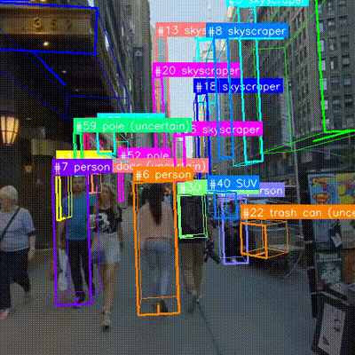

# Zero-Shot 3D Object Tracking

Track objects in video with 3D bounding boxes using WildDet3D -- no tracking-specific training required.

<p align="center">
  
</p>

## How It Works

The pipeline has 3 stages:

1. **Object tracking** (external): Use SAM2 or any video tracker to get per-frame object masks as RLE.
2. **3D detection** (WildDet3D): For each frame, use object mask bboxes as geometric prompts to WildDet3D, which predicts 3D bounding boxes.
3. **Temporal smoothing**: Apply Kalman filter on 3D center + dimensions, and EMA on rotation quaternions, for smooth trajectories.

Since WildDet3D is open-vocabulary, this tracks **any object category** without retraining -- the category label is passed as a text prompt alongside the geometric box prompt.

## Pipeline Overview

```
Video + Object Masks (SAM2)  +  Category Labels (VLM/manual)
                |                        |
                v                        v
    [Per-frame mask bbox]    [Category text prompt]
                |                        |
                +--------+-------+-------+
                         |
                         v
              WildDet3D (geometric prompt)
                         |
                         v
              Per-frame 3D bounding boxes
                         |
                         v
               Kalman Filter Smoothing
                         |
                         v
              Temporally smooth 3D tracks
                         |
                         v
                   Output Video + JSON
```

## Quick Start

```bash
cd WildDet3D

python -m demo.tracking.run_pipeline \
    --video path/to/video.mp4 \
    --masks path/to/masks.json \
    --categories path/to/categories.json \
    --intrinsics path/to/intrinsics.json
```

Output is saved to `demo/tracking/output/`:
- `{video_name}_tracked.mp4` -- video with 3D box overlays
- `{video_name}_results.json` -- per-track 3D boxes for all frames

## Input Format

### Video

Any video file readable by OpenCV (mp4, avi, etc.).

### Masks (`masks.json`)

Per-frame object masks in COCO RLE format. This is a JSON list of `n_frames` elements, where each element is a list of `n_objects` entries (RLE dict or `null` if the object is not visible in that frame).

```json
[
    [
        {"counts": "...", "size": [512, 512]},
        null,
        {"counts": "...", "size": [512, 512]}
    ],
    [
        {"counts": "...", "size": [512, 512]},
        {"counts": "...", "size": [512, 512]},
        null
    ]
]
```

Each RLE dict has `counts` (run-length encoded string) and `size` ([height, width]). These can be generated by:
- [SAM 2](https://github.com/facebookresearch/sam2) video predictor
- Any video object segmentation model that outputs COCO RLE masks
- Converting binary masks with `pycocotools.mask.encode()`

### Categories (`categories.json`)

Object ID to category name mapping. Only objects listed here are tracked (others are ignored).

```json
{
    "0": "car",
    "1": "person",
    "3": "bicycle"
}
```

These can be obtained from:
- Manual annotation
- A VLM (e.g., ask "what object is this?" with the mask crop)
- Class labels from a 2D detector

### Intrinsics

Camera intrinsics matrix. Supports three formats:

**JSON file:**
```json
{"K": [[fx, 0, cx], [0, fy, cy], [0, 0, 1]]}
```

**NumPy file (.npy):**
```python
np.save("intrinsics.npy", K)  # K is (3, 3) float32
```

**Inline string:**
```bash
--intrinsics "443.4,443.4,256.0,256.0"  # fx,fy,cx,cy
```

If you don't have intrinsics, you can estimate them from the image size:
```python
K = [[max(H,W), 0, W/2], [0, max(H,W), H/2], [0, 0, 1]]
```

## Options

```
--video           Input video file (required)
--masks           Object masks JSON (required)
--categories      Category labels JSON (required)
--intrinsics      Camera intrinsics (required)
--checkpoint      Model checkpoint (auto-downloaded if not provided)
--output_dir      Output directory (default: demo/tracking/output/)
--device          cuda or cpu (default: cuda)
--side_by_side    Render raw vs smoothed comparison video
```

## Output Format

### Results JSON

```json
{
    "video_name": "my_video",
    "n_frames": 200,
    "n_tracks": 5,
    "categories": {"0": "car", "1": "person"},
    "tracks": {
        "0": {
            "category": "car",
            "visible_frames": 180,
            "boxes_3d": [
                [cx, cy, cz, w, l, h, qr, qi, qj, qk],
                null,
                [cx, cy, cz, w, l, h, qr, qi, qj, qk],
                ...
            ]
        }
    }
}
```

Each `boxes_3d` entry is a 10-element array `[cx, cy, cz, w, l, h, qr, qi, qj, qk]` in camera coordinates (OPENCV axis mode), or `null` for frames where the object is not visible.

## Kalman Filter Details

The Kalman filter operates on the 3D center position and dimensions:

- **State**: `[cx, cy, cz, w, l, h, vx, vy, vz]` (position + dimensions + velocity)
- **Observation**: `[cx, cy, cz, w, l, h]` from WildDet3D per-frame output
- **Rotation**: smoothed separately via exponential moving average (EMA)

Additional post-processing:
- **Yaw normalization**: Quaternion yaw normalized to `[0, pi)` to remove 180-degree ambiguity
- **90-degree flip fix**: For near-square objects (w/l > 0.7), ensures temporal yaw consistency by resolving 90-degree symmetry ambiguity
