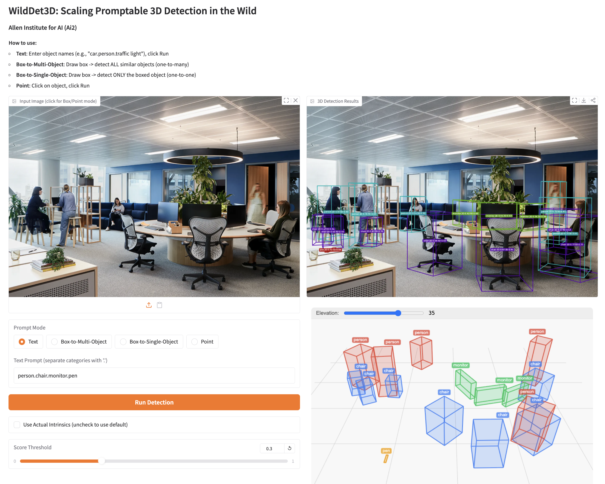
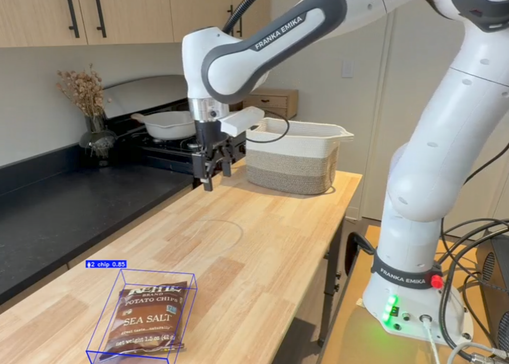

# WildDet3D Interactive Demos

## Gradio Web App

Launch a local interactive demo with text, box, and point prompts.

```bash
# Install demo dependencies
pip install gradio matplotlib

# Run the app
python demo/app.py
# Opens at http://localhost:7860
```

<!-- TODO: Add app.py to demo/ and screenshot -->

### Features

- **Text prompt**: Type category names to detect objects
- **Box prompt**: Click and drag to draw 2D boxes, lift to 3D
- **Point prompt**: Click points on objects for detection
- **Score threshold**: Adjustable confidence slider
- **3D visualization**: GLB mesh export for 3D viewing
- **Depth map**: Visualize predicted metric depth

## HuggingFace Spaces

Try WildDet3D directly in your browser:

<!-- TODO: Add link once deployed -->
**[https://huggingface.co/spaces/weikaih/WildDet3D](https://huggingface.co/spaces/weikaih/WildDet3D)**

<p align="center">
  
</p>

## Platform-Specific Demos

| Platform | Description | README |
|---|---|---|
| iPhone | Real-time on-device 3D detection | [demo/iphone/README.md](../demo/iphone/README.md) |
| Meta Quest | 3D detection in AR/VR | [demo/meta_quest/README.md](../demo/meta_quest/README.md) |
| Meta Glasses | Wearable 3D perception | [demo/meta_glasses/README.md](../demo/meta_glasses/README.md) |
| Robotics | 3D perception for manipulation | [demo/robotics/README.md](../demo/robotics/README.md) |
| VLM Integration | Combine with vision-language models | [demo/vlm/README.md](../demo/vlm/README.md) |

<table>
<tr>
<td align="center">
<a href="../demo/iphone/README.md"></a><br><b>iPhone</b>
</td>
<td align="center">
<a href="../demo/meta_quest/README.md"></a><br><b>Meta Quest</b>
</td>
<td align="center">
<a href="../demo/robotics/README.md"></a><br><b>Robotics</b>
</td>
</tr>
</table>
